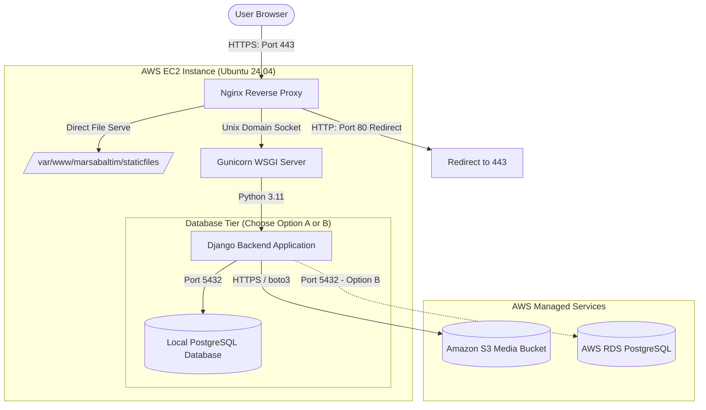

# AWS EC2 Production Architecture - Marsa Baltim

This document details the production-grade, highly reliable, and cost-effective traditional deployment architecture configured for **Marsa Baltim**.

---

## 📐 Overall Architecture Diagram

The deployment is based on a standard, robust 3-tier architecture optimized for maximum speed, security, and low cost during the startup phase.

---

## 🔌 Component Breakdown

### 1. Reverse Proxy Layer: Nginx
* **Role:** Acts as the entry point for all incoming traffic.
* **Responsibilities:**
  * **SSL Termination:** Offloads SSL encryption/decryption using certificates generated by **Let's Encrypt**.
  * **HTTP-to-HTTPS Redirection:** Seamlessly redirects all port 80 traffic to secure port 443.
  * **Static Asset Serving:** Directly serves compiled CSS, JS, and font files from the local filesystem (`/var/www/marsabaltim/staticfiles/`) at the OS kernel level using `sendfile on`, completely bypassing Python for speed and low CPU usage.
  * **Reverse Proxying:** Forwards dynamic API and admin page requests to Gunicorn via a high-performance **Unix Domain Socket** rather than a TCP port (reducing latency and TCP overhead).

### 2. WSGI Server Layer: Gunicorn
* **Role:** Acts as the high-performance Python application server.
* **Responsibilities:**
  * Runs multiple worker processes based on CPU cores (`(2 * Cores) + 1`) using the efficient `gthread` sync model.
  * Managed by **Systemd** using **Socket Activation**. Systemd listens on the socket and spawns Gunicorn as soon as the first request arrives, ensuring seamless restarts and 100% uptime.

### 3. Application Layer: Django
* **Role:** Core business logic, APIs, and Admin dashboard.
* **Configurations:**
  * `DEBUG = False` (Mandatory).
  * Strict security settings (HSTS headers, Session/CSRF Secure cookies).
  * Standard console logging routed directly to systemd's **journald** for easy auditing via `journalctl`.

### 4. Media Storage Layer: Amazon S3
* **Role:** Reliable, durable, and infinitely scalable storage for user-uploaded media (property images, payment receipts, QR codes).
* **Benefits:** Bypasses local filesystem storage, keeping the EC2 instance completely stateless and allowing easy future scaling.

### 5. Database Layer: PostgreSQL
* **Option A (Startup / Low Cost):** Run PostgreSQL directly inside the EC2 instance. This has **$0 extra cost** but requires manual backups.
* **Option B (Reliable / Scale):** Run PostgreSQL via **AWS RDS**. Provides automated backups, high availability, and 99.99% uptime.

---

## 🔒 Security Measures
* **Strict Security Group:** Only ports `22` (restricted to your IP), `80` (open), and `443` (open) are exposed on the host. PostgreSQL port `5432` is bound only to `localhost` to block external hacks.
* **Safe User Privileges:** Gunicorn runs under a dedicated, restricted system user `django` with no root privileges.
